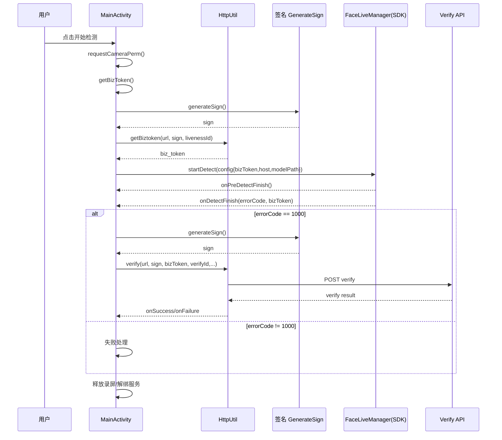

# MainActivity 人脸活体流程说明（公有云）

本文只梳理 `MainActivity` 的流程，目标是让你快速看懂「从点按钮到拿到核验结果」的完整链路。

---

## 1. 一句话总览

`MainActivity` 的核心逻辑是：

1. 申请相机权限  
2. 向服务端获取 `biz_token`  
3. 调用 SDK 开始活体检测  
4. 检测成功后调用 `verify` 做比对/核验  
5. 回收录屏相关资源（如果有）

---

## 2. 角色分工（你先记这几个）

- `MainActivity`：流程总控（权限、拿 token、启动 SDK、触发 verify）。
- `HttpUtil`：发网络请求（`getBiztoken`、`verify`）。
- `GenerateSign`：生成接口签名（`sign`）。
- `FaceLiveManager`（SDK）：执行活体检测。
- `RecordService`：可选录屏能力（把 `MediaProjection` 传给 SDK）。

---

## 3. 主流程图（业务视角）

```mermaid
flowchart TD
    A[进入 MainActivity] --> B[加载模型文件 facelivemodel.bin 到本地]
    B --> C[点击 开始检测 bt_start]
    C --> D{CAMERA 权限是否已授权}
    D -- 否 --> E[requestPermissions CAMERA]
    E --> F{授权结果}
    F -- 拒绝 --> X[结束/提示用户]
    F -- 允许 --> G[getBizToken]
    D -- 是 --> G[getBizToken]

    G --> H[generateSign 生成签名]
    H --> I[HttpUtil.getBiztoken 请求 biz_token]
    I --> J{请求是否成功}
    J -- 否 --> Y[记录失败日志]
    J -- 是 --> K[startDetect(token, modelPath)]

    K --> L[构建 FaceLiveDetectConfig]
    L --> M[FaceLiveManager.startDetect]
    M --> N[onPreDetectFinish 初始化回调]
    N --> O[进入活体采集页面并完成检测]
    O --> P[onDetectFinish 返回结果]
    P --> Q{errorCode == 1000 ?}
    Q -- 否 --> Z[失败处理]
    Q -- 是 --> R[verify]

    R --> S[generateSign 重新签名]
    S --> T[HttpUtil.verify 请求核验结果]
    T --> U[onSuccess/onFailure 日志与业务处理]

    P --> V[释放 MediaProjection / unbindService / 清理引用]
```

---

## 4. 调用顺序（代码执行顺序）

下面是你最关心的“按时间线发生了什么”：

1. `onCreate()`  
   - 初始化 UI、`HttpUtil`。  
   - 调用 `saveAssets("facelivemodel.bin", "model")`，把模型从 assets 拷到可访问路径。  
   - 给 `bt_start` 绑定点击事件。  

2. 点击 `bt_start` -> `requestCameraPerm()`  
   - Android M+：检查 CAMERA 权限。  
   - 未授权则 `requestPermissions`，授权回调在 `onRequestPermissionsResult()`。  
   - 已授权/授权通过后调用 `getBizToken()`。  

3. `getBizToken()`  
   - 先 `generateSign()` 生成签名。  
   - 调 `mHttpUtil.getBiztoken(...)` 请求后端 `biz_token`。  
   - 成功后解析 JSON 取出 `biz_token`，再调 `startDetect(token, modelPath)`。  

4. `startDetect(token, modelPath)`  
   - 构建 `FaceLiveDetectConfig`：  
     - `bizToken`  
     - `host`  
     - `modelPath`  
     - `mediaProjection`（可选录屏）  
   - 调用 `FaceLiveManager.getInstance().startDetect(...)`。  

5. SDK 回调阶段  
   - `onPreDetectFinish(...)`：SDK 初始化结果。  
   - `onDetectFinish(errorCode, ..., bizToken)`：检测最终结果。  
     - `errorCode == 1000`：调用 `verify()`。  
     - 其他：走失败分支。  
   - `onLivenessFileCallback(...)`：返回活体文件路径（可做留存/排障）。  

6. `verify()`  
   - 再次 `generateSign()`。  
   - 组装 `uuid`、`verify_id`、`comparison_type` 等参数。  
   - 调 `mHttpUtil.verify(...)` 请求核验接口。  
   - 在回调里拿核验响应（注意：接口成功不代表比对通过，要看返回字段）。  

7. 收尾清理（在 `onDetectFinish` 末尾）  
   - 停止并清理 `MediaProjection`。  
   - `unbindService(connection)`。  
   - 置空 `projectionManager`。  

---

## 5. 时序图（技术视角）



---

## 6. 关键配置项（不配会跑不通）

- `API_KEY`：已写在示例中。
- `SECRET`：当前示例是空字符串，需替换成真实值。
- `LIVENESS_ID`：活体场景 ID，当前为空，必须配置。
- `VERIFY_ID`：核验场景 ID，当前为空，必须配置。
- `GET_BIZTOKEN_URL` / `VERIFY_URL` / `HOST`：需要与你的服务环境一致。

---

## 7. 常见卡点（你排查时优先看）

- 点击开始无反应：先看 CAMERA 权限是否被拒绝。
- 活体起不来：看 `onPreDetectFinish` 的 `errorCode/errorMessage`。
- 活体成功但核验失败：检查 `VERIFY_ID`、`SECRET`、请求参数和服务端返回 `result_message`。
- 线上建议：`getBizToken/verify` 最好放服务端中转，不在客户端直连核心密钥逻辑。

---

## 8. 你可以直接按这个最短路径验证

1. 配好 `SECRET`、`LIVENESS_ID`、`VERIFY_ID`。  
2. 安装运行后，点「开始检测」。  
3. 完成人脸活体动作。  
4. 看日志中 `onDetectFinish` 是否 `1000`，以及 `verify` 返回体。  

